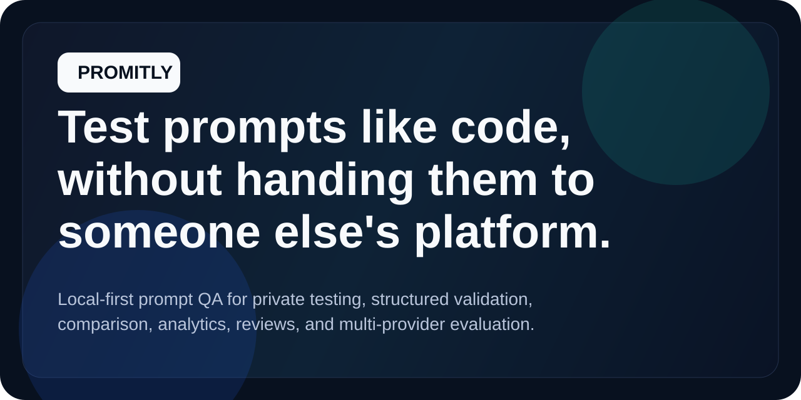
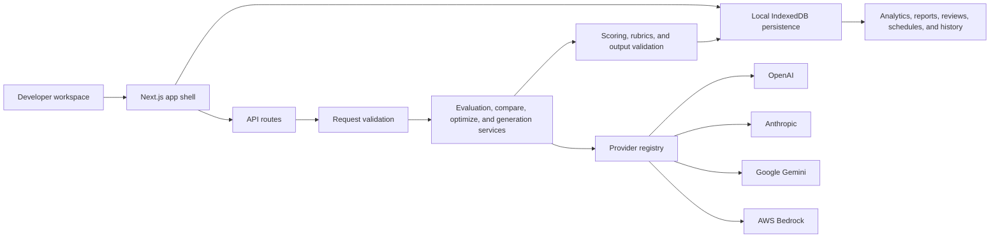

# Promitly

<p align="center">
  
</p>

<p align="center">
  <strong>Test prompts like code, without handing them to someone else's platform.</strong>
</p>

<p align="center">
  <a href="https://github.com/yogeshsingh2672000/prompt-testing-dashboard/actions/workflows/ci.yml">
    
  </a>
  <a href="./LICENSE">
    
  </a>
  
</p>

Promitly is a local-first prompt QA platform for teams that want to test, compare, and review prompts inside their own environment.
It helps you catch regressions, enforce structured output contracts, and evaluate across providers before release.
What makes it different: Promitly was built specifically for developers who do not want to expose prompt logic to a hosted prompt testing product.

## Why Developers Click Star

- Keep prompt logic in your own environment instead of pasting it into a hosted evaluator.
- Bring your own provider credentials at runtime, including AWS Bedrock, OpenAI, Anthropic, and Google.
- Compare prompt versions, score with rubrics, review failures, and export reports from one local workflow.
- Run a serious prompt QA process without needing a remote control plane first.

## Demo

Promitly is intentionally local-first. That means the best demo is usually your own instance running against your own prompts and keys.

- Live demo: private by design. Run it locally in a few commands or deploy your own copy.
- Recommended 25-second GIF capture for the repo:
  1. Open `Workspace` and paste a system prompt.
  2. Add 2 test cases, including one JSON validation rule.
  3. Run evaluation and show scores appearing in `Results`.
  4. Jump to `Compare` and show version A/B deltas.
  5. Open `Reviews` and approve or reject a failed case.

If you publish a hosted demo later, keep the messaging the same: Promitly exists so developers can run prompt QA in a controlled environment, not depend on a third-party testing dashboard.

## Features

- **Private local prompt QA**: Evaluate prompts without handing prompt logic to another hosted platform.
- **Bring-your-own-provider workflow**: Use OpenAI, Anthropic, Google Gemini, or AWS Bedrock with user-supplied runtime credentials.
- **Prompt comparison that catches regressions**: Compare prompt versions on the same dataset and inspect per-case winners and score deltas.
- **Structured output enforcement**: Validate JSON, prefix, substring, and regex rules so format-sensitive prompts stay safe to ship.
- **Human review on top of automated scoring**: Add reviewer notes, approvals, rejections, and final overrides to saved runs.
- **Datasets, schedules, and reports**: Save reusable suites, schedule recurring checks, and export HTML or Markdown run reports.
- **Trend analytics built for release decisions**: Track pass rates, rubric quality, regressions, and model leaderboards over time.

## Who This Is For

Promitly is for:

- AI engineers shipping internal LLM features
- teams evaluating prompts for support, extraction, classification, and agent workflows
- developers working with sensitive prompts or proprietary business logic
- builders who want prompt QA discipline without adopting a hosted prompt-ops platform first
- open-source contributors interested in local-first AI tooling, evaluation, and developer experience

## Why This Exists

Most prompt testing products assume you are comfortable sending prompts, outputs, and evaluation logic to a hosted service.
Promitly was built for the opposite case.

The project started from a simple need: give developers a secluded environment where they can test prompts locally, compare versions, validate outputs, and review failures without exposing prompt logic to the world.

That local-first privacy story is not a side benefit. It is the product.

## Real-World Use Cases

1. Validate a JSON extraction prompt before wiring it into a production workflow.
2. Compare a new support-bot prompt against the current version and catch regression cases before release.
3. Run a recurring QA suite against a Bedrock, OpenAI, Anthropic, or Gemini model after prompt changes.
4. Review failed outputs with a human override workflow before promoting a prompt version.
5. Export a report for teammates after a prompt evaluation sprint or release review.

## Proof It Is Built Seriously

- 60+ automated tests cover provider selection, request validation, evaluation services, exports, reports, and scoring logic.
- Multi-provider support works through a shared abstraction instead of hardcoded provider-specific routes.
- Runtime credentials entered in the UI are session-only and are not persisted with runs, suites, schedules, or settings.
- The app already includes structured metadata, social previews, contributor templates, CI, changelog, and release notes.

## Architecture



## Quick Start

### 1. Clone

```bash
git clone https://github.com/yogeshsingh2672000/prompt-testing-dashboard.git
cd prompt-testing-dashboard
```

### 2. Install and configure

```bash
npm install
cp .env.example .env.local
```

Add env keys for any provider you want to use, or supply them at runtime inside the UI.

### 3. Run

```bash
npm run dev
```

Open `http://localhost:3000`.

## Example Input -> Output

### Input

System prompt:

```txt
Extract a support ticket summary as strict JSON with keys: priority, topic, customer_sentiment.
```

Test case:

```json
{
  "input": "My billing page charged me twice and support has not replied for 3 days.",
  "expectedOutput": "{\"priority\":\"high\",\"topic\":\"billing\",\"customer_sentiment\":\"frustrated\"}",
  "validation": {
    "type": "json"
  }
}
```

### Output

```json
{
  "output": {
    "priority": "high",
    "topic": "billing",
    "customer_sentiment": "frustrated"
  },
  "semanticScore": 0.97,
  "rubricScore": 0.95,
  "overallScore": 0.96,
  "formatValid": true,
  "passed": true
}
```

## Project Structure

```txt
app/
  [locale]/(platform)/...   Route entry points and shell
  api/                      Thin route handlers

features/
  dashboard/                Workspace, results, history
  compare/                  A/B comparison workbench
  datasets/                 Dataset manager
  reviews/                  Human review workflow
  analytics/                Trend and leaderboard views
  settings/                 Defaults and rubric presets
  navigation/               App shell and route framing

server/
  lib/                      AI clients and provider registry
  services/                 Evaluation, validation, generation, comparison

shared/
  constants/                Site, models, defaults
  lib/                      Persistence, reports, exports, summaries
  types/                    Shared domain types
  ui/                       Reusable UI primitives
```

## Roadmap

- CLI and CI-friendly run execution for prompt regression checks in GitHub Actions
- richer schema-aware output validation beyond simple JSON and regex checks
- flaky-case detection across repeated prompt runs
- hosted team workspaces for teams that want collaboration after starting local-first
- more granular provider status and runtime credential diagnostics

## Contributing

Promitly is intentionally contributor-friendly.

- Start with [CONTRIBUTING.md](./CONTRIBUTING.md)
- Use the issue templates in [`.github/ISSUE_TEMPLATE`](./.github/ISSUE_TEMPLATE)
- Check the seeded improvement ideas in [`.github/ISSUE_DRAFTS`](./.github/ISSUE_DRAFTS)
- Run `npm run lint`, `npm run test`, and `npm run build` before opening a PR

Good first areas:

- provider UX polish
- accessibility improvements
- analytics/reporting refinements
- dataset workflows
- docs and onboarding improvements

## Release Status

Promitly is ready for a public `v0.1.0` launch.

- Release notes: [docs/releases/v0.1.0.md](./docs/releases/v0.1.0.md)
- Changelog: [CHANGELOG.md](./CHANGELOG.md)
- Suggested GitHub About, topics, and launch copy: [`.github/REPOSITORY_PROFILE.md`](./.github/REPOSITORY_PROFILE.md)

## License

[MIT](./LICENSE)
